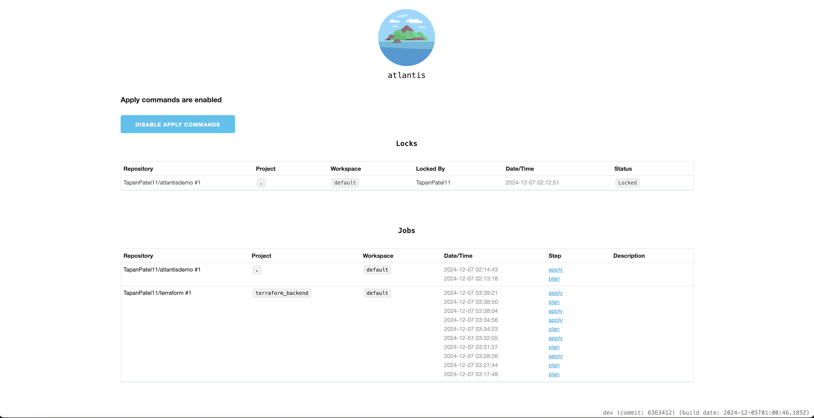

!!! abstract "What's Atlantis?"
    **Atlantis** is an infrastructure automation tool for managing Terraform pull requests. This document outlines the architecture, AWS services used, and deployment details of Atlantis configured with ECS Fargate and Terraform.
    Atlantis automates the Terraform workflow by integrating with GitHub, providing a secure and scalable deployment. [Read more..](https://www.runatlantis.io)

!!!note "Why Implement Atlantis?"
    I implemented a minimalistic version of **Atlantis** to showcase my proficiency in **Terraform**, **AWS ECS**, **networking**, and **automation**. This project demonstrates the ability to orchestrate infrastructure as code, deploy scalable containerized applications, and create secure and efficient cloud networks.

    While there is already a ready-to-go Terraform module available for Atlantis for AWS Fargate, I chose to develop my own module to gain deeper control and understanding of the services. This approach allows me to customize configurations, troubleshoot effectively, and enhance my expertise in cloud service orchestration.
     
---

## Features

???+ example "Why use Atlantis?"

    - [x] **Infrastructure Automation**  
      Automatically plans and applies Terraform changes via GitHub pull requests.
    - [x] **Serverless Deployment**  
      Utilizes **AWS ECS Fargate** for containerized deployments without server management.
    - [x] **Highly Available**  
      Built with AWS services ensuring fault tolerance and scalability.

    - [x] **GitHub Integration**  
      Supports pull request workflows for Terraform, enabling collaboration and version control.

    - [x] **Serverless Architecture**  
      Runs as a containerized service on AWS ECS Fargate, reducing operational overhead.

    - [x] **Secure Secrets Management**  
      Integrates with AWS Secrets Manager for securely storing sensitive credentials.

    - [x] **Scalable Design**  
      Leverages AWS Application Load Balancer and Fargate to handle varying loads dynamically.

    - [x] **Simplified Networking**  
      Configured with VPC, subnets, and security groups to ensure secure communication.

---

## Atlantis Walkthrough

{ align=left }

### Atlantis Demo on My Personal Repos

To see a simple demo showcasing how Atlantis works in real life, visit the following pull request on my personal repository:  
     [**Atlantis Demo Pull Request**](https://github.com/TapanPatel11/terraform/pull/1)

### Atlantis Admin UI 

Alternatively, Admin/SRE team can manage all the PRs via Atlantis UI secured via web authentication
{ align=left }

---
## Architecture

!!! tip "Serverless Architecture"
    Atlantis runs on a **serverless architecture** powered by AWS ECS Fargate, with a well-architected VPC setup for security and and Load Balancer for high availability.

---

!!!warning "Architecture Diagram"
    Coming soon..
<!-- { align=left } -->

---

### **AWS Services Used**

| Service                  | Purpose                                         |
|--------------------------|-------------------------------------------------|
| **AWS VPC**              | Isolates resources within a secure network.    |
| **AWS Subnets**          | Divides the network for better resource allocation. |
| **AWS ECS Fargate**      | Runs containerized applications without servers. |
| **AWS Secrets Manager**  | Securely stores environment variables.         |
| **AWS Application Load Balancer** | Distributes traffic to ECS tasks.         |
| **AWS Security Groups**  | Controls inbound/outbound traffic.             |
| **AWS IAM Roles**        | Provides granular permissions for resources.   |

## Deployment

Atlantis is deployed on **AWS ECS Fargate** with the following key components:

- **Task Definition**: Configured with container settings, environment variables, and secrets.
- **ECS Service**: Manages container instances and integrates with the load balancer.
- **Terraform**: Automates the provisioning of all resources.

---


### Deployment Workflow

1. **Clone the Atlantis Repository**  
   Clone the repository containing the Terraform files for Atlantis:  
   ```bash
   git clone https://github.com/tapanpatel11/terraform/atlantis.git
   ```

2. **Provision the Network Infrastructure**  
   Navigate to the `network` folder and apply the Terraform configuration to set up the necessary VPC, subnets, and other network resources:  
   ```bash
   cd atlantis/network
   terraform apply
   ```

3. **Provision the ECS Services**  
   Navigate to the `ecs` folder and apply the Terraform configuration to deploy Atlantis on ECS:  
   ```bash
   cd ../ecs
   terraform apply
   ```

---

#### Prerequisites  

Before applying the configurations, ensure the following prerequisites are met:  

- **IAM Role for ECS**  
  An IAM role is required to allow ECS tasks to interact with AWS services.  

- **IAM User for Atlantis**  
  Create an IAM user with permissions to use the Atlantis application.  

- **Secrets in AWS Secrets Manager**  
  The following secrets must be configured in AWS Secrets Manager for Atlantis to run:  

  - `ATLANTIS_GH_TOKEN`
  - `ATLANTIS_GH_USER`
  - `ATLANTIS_GH_WEBHOOK_SECRET`
  - `ATLANTIS_REPO_ALLOWLIST`
  - `AWS_ACCESS_KEY_ID`
  - `AWS_DEFAULT_REGION`
  - `AWS_SECRET_ACCESS_KEY`

Refer to the [official Atlantis documentation](https://www.runatlantis.io) for detailed instructions on generating a GitHub token and setting up the webhook.


---


## Security Features

Atlantis ensures robust security using AWS best practices:

- **VPC Isolation**: Ensures resources are private and secure.
- **Security Groups**: Restricts inbound/outbound traffic to only github webhook IP CIDRs.
- **Secrets Management**: Uses AWS Secrets Manager to handle sensitive data securely.
- **IAM Roles and Policies**: Adheres to the principle of least privilege.
- **Encrypted Communication**: Utilizes HTTPS for secure data transmission.

!!!warning "To be included"
    - [x] Change the default port of atlantis
    - [x] Add Atlantis UI web authentication
    - [x] Restrict atlantis commands (apply, plan) to specific teams/members
    - [x] Allow apply only when review requirements are met
    - [x] Close public UI access and access it via VPN (such as Twingate)
    - [x] change the default mount volume of atlantis

## Cost Analysis

### Upfront Costs
- **Terraform Setup**: Provisioning AWS resources via Terraform incurs initial resource costs.
- **Docker Image**: Building and storing the Atlantis Docker image.

### Ongoing Costs
| Service                  | Cost Basis                                      |
|--------------------------|-------------------------------------------------|
| **ECS Fargate**          | Pay-as-you-go for vCPU and memory.              |
| **Application Load Balancer** | Based on traffic handled by the ALB.           |
| **Secrets Manager**      | Based on the number of secrets stored.          |
| **Terraform State Storage** | Using S3 and dynamoDB for backend state management.          |


---


## **Contact**

!!!question "Any doubts?"
    Feel free to reach out if you have any suggestions, doubt's or wish to know more! Thanks!

---
